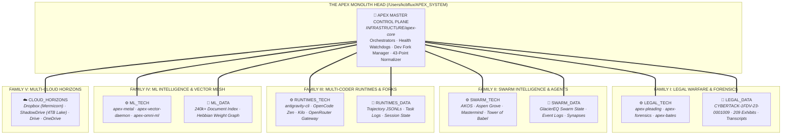

# 🗺️ APEX MASTER REPOSITORY MESH & FUNCTIONAL TAXONOMY

> **The Monolith as the Sovereign Head:**  
> The APEX Monolith (`/Users/kcbflux/APEX_SYSTEM`) functions as the central coordinating umbrella—the sovereign head that maps out all repositories, runtimes, evidence vaults, and cloud horizons into clean **Families** and **Functions**, with strict ontological separation between **Technology (Engines & Tools)** and **Data (Evidence & State)**.

---

---

## 🏛️ Comprehensive Repository Taxonomy

### 👑 0. The Master Head (Control Plane & Infrastructure)
* **Locus**: [`/Users/kcbflux/APEX_SYSTEM/INFRASTRUCTURE/apex-core`](file:///Users/kcbflux/APEX_SYSTEM/INFRASTRUCTURE/apex-core)
* **Operational Mandate**: The central nervous system uniting all repositories, scripts, tests, and codices.
* **Core Components**:
  * `apex_fork_manager.py` (`apex-forks`): Dev Fork Doctrine orchestrator.
  * `verify_normalized_foundation.py` (`apex-audit`): 43-point foundation quality auditor.
  * `sync_mcp_pool.py` (`apex-sync`): Two-tier MCP pool synchronizer.
  * `apex_harden.py`: POSIX permission hardening (0o600 / 0o755).
  * `apex_daemon.py` (`apex-daemon`): Hourly drift guard and integrity watchdog.
  * `AGENTS.md`: The APEX Sovereign Master Codex.

---

### ⚖️ Family I: Legal Warfare & Forensics
Strictly decoupled into **Legal Tech (Engines)** and **Legal Data (Evidence)**:

#### 1. ⚙️ Legal Tech (`APEX_SYSTEM/DOMAINS/LEGAL_WARFARE/LEGAL_TECH`)
* [`apex_pleading_builder.py`](file:///Users/kcbflux/APEX_SYSTEM/DOMAINS/LEGAL_WARFARE/LEGAL_TECH/apex_pleading_builder.py) (`apex-pleading`): Automated synthesizer for Hawaii Family Court Rule 60(b)(4) Motions to Vacate and Federal Civil Rights (§ 1983) Complaints.
* [`cyber_timeline_engine.py`](file:///Users/kcbflux/APEX_SYSTEM/DOMAINS/LEGAL_WARFARE/LEGAL_TECH/cyber_timeline_engine.py) (`apex-forensics`): Ingests 200+ exhibits, evaluates 27 anomaly patterns, and compiles `00_FORENSIC_MASTER_TIMELINE.json`.
* [`forensic_manifest.py`](file:///Users/kcbflux/APEX_SYSTEM/DOMAINS/LEGAL_WARFARE/LEGAL_TECH/forensic_manifest.py) (`apex-bates`): Deterministic SHA-256 Bates numbering engine complying with Federal Rules of Evidence FRE 902(13)/(14).

#### 2. 📁 Legal Data (`APEX_SYSTEM/DOMAINS/LEGAL_WARFARE/LEGAL_DATA`)
* [`CYBERTACK-1FDV-23-0001009/`](file:///Users/kcbflux/APEX_SYSTEM/DOMAINS/LEGAL_WARFARE/LEGAL_DATA/CYBERTACK-1FDV-23-0001009): Primary active litigation evidence lake.
  * `SYNTHESIZED_PLEADINGS/`: Generated court-ready motions and affidavits.
  * `00_FORENSIC_MASTER_TIMELINE.md`: Human-readable chronological evidence index.
  * `00_FORENSIC_MASTER_TIMELINE.json`: Machine-parsable timeline with SHA-256 digests.
* [`01_Legal_Codex/`](file:///Users/kcbflux/APEX_SYSTEM/DOMAINS/LEGAL_WARFARE/LEGAL_DATA/01_Legal_Codex): Legal precedents, HFCR Rule 60(b)(4) statutory motions, and case law briefs.
* [`forensics/`](file:///Users/kcbflux/APEX_SYSTEM/DOMAINS/LEGAL_WARFARE/LEGAL_DATA/forensics): Raw carve sessions, photorec logs, and recovered unallocated disk sectors.

---

### 🐝 Family II: Swarm Intelligence & Autonomous Agents

#### 1. ⚙️ Swarm Tech
* [`GlacierEQ/AKOS`](file:///Users/kcbflux/APEX_SYSTEM/DOMAINS/SWARM_INTELLIGENCE/AKOS): Apex Kernel Operating System, system daemons, and governance contracts.
* [`GlacierEQ/aspen-grove-core`](file:///Users/kcbflux/APEX_SYSTEM/DOMAINS/SWARM_INTELLIGENCE/aspen-grove-core): Resilient agent swarm root trees and distributed state mesh.
* [`GlacierEQ/Apex_Mastermind`](file:///Users/kcbflux/APEX_SYSTEM/DOMAINS/SWARM_INTELLIGENCE/Apex_Mastermind): Multi-agent control plane, Cap'n Proto zero-copy RPC, task scheduler.
* [`GlacierEQ/the-tower-of-babel`](file:///Users/kcbflux/APEX_SYSTEM/DOMAINS/SWARM_INTELLIGENCE/tower_of_babel): 51-language cross-compilation bridge and formal verification gates.
* [`apex_swarm_dialectic.py`](file:///Users/kcbflux/APEX_SYSTEM/INFRASTRUCTURE/apex-core/scripts/apex_swarm_dialectic.py) (`apex-swarm-dialectic`): 4-phase dialectic pipeline (R1 -> MiMo -> Qwen -> V3).

#### 2. 📁 Swarm Data
* [`GlacierEQ_Swarm/`](file:///Users/kcbflux/APEX_SYSTEM/DOMAINS/SWARM_INTELLIGENCE/GlacierEQ_Swarm): Swarm session logs, dialectic output records, and task state matrices.

---

### 💻 Family III: Multi-Coder Runtimes & Dev Forks

#### 1. ⚙️ Runtimes Tech
* [`GlacierEQ/antigravity-cli`](file:///Users/kcbflux/antigravity-cli): Google Antigravity Agent Runtime fork + Dev Fork Overlay pipeline.
* `opencode-zen`: Ultra-low-latency local coding sandbox.
* `kilo-hub`: Multi-model aggregator and token cost optimizer.
* `openrouter-free-gateway`: MCP gateway pool for DeepSeek, Qwen, MiMo, Llama.
* [`antigravity_coder_bridge.py`](file:///Users/kcbflux/antigravity-cli/antigravity_coder_bridge.py) (`agy-coder`): Universal multi-engine dispatcher.

#### 2. 📁 Runtimes Data
* `~/.gemini/antigravity-cli/brain/`: Trajectory logs, scratch data, and subagent session transcripts.

---

### 🧠 Family IV: Machine Learning & Vector Memory

#### 1. ⚙️ ML Tech
* [`apex_ml_metal_engine.py`](file:///Users/kcbflux/APEX_SYSTEM/INFRASTRUCTURE/apex-core/scripts/apex_ml_metal_engine.py) (`apex-metal`): Apple Silicon Metal/AMX hardware tensor vector acceleration engine (11,000+ ops/sec, 2.18ms latency).
* [`apex_vector_daemon.py`](file:///Users/kcbflux/APEX_SYSTEM/INFRASTRUCTURE/apex-core/scripts/apex_vector_daemon.py) (`apex-vector-daemon`): Continuous background delta embedding daemon.
* [`omniversal_ml_engine.py`](file:///Users/kcbflux/APEX_SYSTEM/ENGINES/ML_INTELLIGENCE/omniversal_ml_engine.py) (`apex-omni-ml`): Subword 3-gram shingling, TF-IDF cosine metrics, and Hebbian synapses.

#### 2. 📁 ML Data
* `~/.local_memory/`: Master 240k+ multi-cloud file index (`omni_cloud_ml_index.json`) and semantic graph matrix.

---

### ☁️ Family V: Multi-Cloud Horizons & Storage Lakes
* **Dropbox Horizon** (`/Users/kcbflux/Dropbox-Cyber.lazer.mermicor`): Mermicorn case briefs, isolated workspace configs.
* **ShadowDrive Lake** (4.0 TB Master Evidence Lake): Raw unallocated disk dumps, media archives.
* **Google Drive / OneDrive**: PACER filings, certified court recordings, external discovery.
