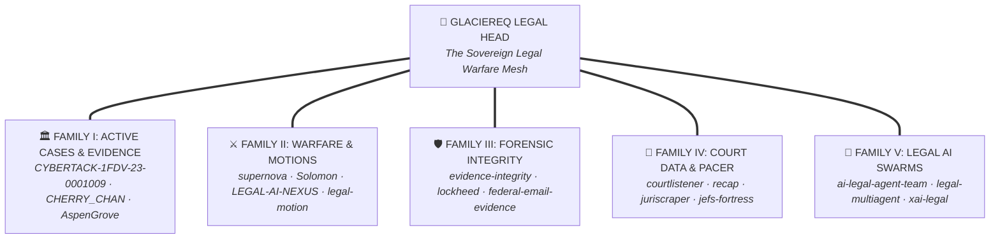

# 🏛️ GlacierEQ Sovereign Legal Repository Taxonomy & Master Mesh

> **Generated**: `2026-08-24 20:22:15 UTC`  
> **Sovereign Standard**: Unified Legal Knowledge Mesh across all 80+ GitHub Repositories (`github.com/GlacierEQ/*`).

---

## 🔱 Sovereign Ontological Cartography

---
## 🏛️ FAMILY I: ACTIVE DOCKETS, LIVING LITIGATION & EVIDENCE VAULTS
*Specific active cases, dockets, exhibits manifests, Bates collections, and encrypted evidence vaults.*

| Repository Name | GitHub URL | Description & Role |
|---|---|---|
| **[`CYBERTACK-1FDV-23-0001009`](https://github.com/GlacierEQ/CYBERTACK-1FDV-23-0001009)** | [`github.com/GlacierEQ/CYBERTACK-1FDV-23-0001009`](https://github.com/GlacierEQ/CYBERTACK-1FDV-23-0001009) | 🔱 CYBERTACK — Case 1FDV-23-0001009 Cyberattack Investigation — 40 exhibits, $12.8M damages, Brower connection, evidence tampering (MD5 verified) |
| **[`CASE-1FDV-23-0001009`](https://github.com/GlacierEQ/CASE-1FDV-23-0001009)** | [`github.com/GlacierEQ/CASE-1FDV-23-0001009`](https://github.com/GlacierEQ/CASE-1FDV-23-0001009) | Federal case: Casey Barton v. Brower et al. — RICO, §1983, CFAA. 117 files, 28 motions, 22 defendants. |
| **[`case-1FDV-23-0001009-legal-documents`](https://github.com/GlacierEQ/case-1FDV-23-0001009-legal-documents)** | [`github.com/GlacierEQ/case-1FDV-23-0001009-legal-documents`](https://github.com/GlacierEQ/case-1FDV-23-0001009-legal-documents) | Legal document repository for Hawaii Family Court Case 1FDV-23-0001009 - Custody Modification. Version-controlled motions, briefs, evidence logs, and case strategy. |
| **[`CASE-1FDV-23-0001009-LEAN`](https://github.com/GlacierEQ/CASE-1FDV-23-0001009-LEAN)** | [`github.com/GlacierEQ/CASE-1FDV-23-0001009-LEAN`](https://github.com/GlacierEQ/CASE-1FDV-23-0001009-LEAN) | Lean case file — 142 files, 3MB, all motions and evidence references |
| **[`AspenGrove-KEKOA-1FDV-23-0001009`](https://github.com/GlacierEQ/AspenGrove-KEKOA-1FDV-23-0001009)** | [`github.com/GlacierEQ/AspenGrove-KEKOA-1FDV-23-0001009`](https://github.com/GlacierEQ/AspenGrove-KEKOA-1FDV-23-0001009) | Aspen Grove Quantum Memory + Potato Peeler Constitutional Warfare Knowledge Base for Case 1FDV-23-0001009 - Kekoa Barton Liberation - Persistent OSINT, Legal Templates, Evidence Vault Sync - All assets carryover-guaranteed |
| **[`CHERRY_CHAN_RECOVERY_MATRIX`](https://github.com/GlacierEQ/CHERRY_CHAN_RECOVERY_MATRIX)** | [`github.com/GlacierEQ/CHERRY_CHAN_RECOVERY_MATRIX`](https://github.com/GlacierEQ/CHERRY_CHAN_RECOVERY_MATRIX) | Dedicated Forensic & Legal Recovery Matrix for Cherry Chan (Vegas Case) - SEPARATED FROM MAIN STACK |
| **[`erik-breisacher-legal-investigation`](https://github.com/GlacierEQ/erik-breisacher-legal-investigation)** | [`github.com/GlacierEQ/erik-breisacher-legal-investigation`](https://github.com/GlacierEQ/erik-breisacher-legal-investigation) | Comprehensive legal case management repository for Erik Breisacher criminal investigation - theft, harassment, extortion case documentation with automated analysis tools |
| **[`EVIDENCE-VAULT-ENCRYPTED`](https://github.com/GlacierEQ/EVIDENCE-VAULT-ENCRYPTED)** | [`github.com/GlacierEQ/EVIDENCE-VAULT-ENCRYPTED`](https://github.com/GlacierEQ/EVIDENCE-VAULT-ENCRYPTED) | 🔒 HIGHLY CONFIDENTIAL - Encrypted evidence repository for case 1FDV-23-0001009. Chain of custody tracking. Git-LFS enabled for large files. SHA-256 hashing for admissibility. |
| **[`Pro-Evidence`](https://github.com/GlacierEQ/Pro-Evidence)** | [`github.com/GlacierEQ/Pro-Evidence`](https://github.com/GlacierEQ/Pro-Evidence) | 🔍 Pro-tier forensic evidence vault — MEGA-PDF system, OCR, Bates numbering, SHA-256 hash chain, exhibit catalog, Dropbox 1FDV sync, AI-powered document consciousness - Case 1FDV-23-0001009 - GlacierEQ APEX |
| **[`aspen-grove-evidence`](https://github.com/GlacierEQ/aspen-grove-evidence)** | [`github.com/GlacierEQ/aspen-grove-evidence`](https://github.com/GlacierEQ/aspen-grove-evidence) | 🔍 ASPEN GROVE EVIDENCE — MEGA-PDF forensic vault, OCR, Bates numbering, SHA-256 hash chain, exhibit catalog, Dropbox 1FDV sync. Inherits Spiral Engine from aspen-grove-core. Case 1FDV-23-0001009 - GlacierEQ |
| **[`aspen-grove-legal`](https://github.com/GlacierEQ/aspen-grove-legal)** | [`github.com/GlacierEQ/aspen-grove-legal`](https://github.com/GlacierEQ/aspen-grove-legal) | ⚖️ ASPEN GROVE LEGAL — HRS corpus, RICO library, 42 U.S.C. §1983 templates, Constitutional Warfare KB, motion drafter. Inherits Spiral Engine from aspen-grove-core. Case 1FDV-23-0001009 - GlacierEQ |
| **[`apex-legal-case`](https://github.com/GlacierEQ/apex-legal-case)** | [`github.com/GlacierEQ/apex-legal-case`](https://github.com/GlacierEQ/apex-legal-case) | APEX Legal Intelligence — Case 1FDV-23-0001009 Hawaii First Circuit Family Court |

## ⚔️ FAMILY II: LEGAL WARFARE, MOTION ENGINES & PLEADING SYNTHESIZERS
*Automated motion builders, Hawaii Family Court Rule compilers, LaTeX LawTeX engines, and multi-jurisdiction strike systems.*

| Repository Name | GitHub URL | Description & Role |
|---|---|---|
| **[`supernova-legal-warfare-system`](https://github.com/GlacierEQ/supernova-legal-warfare-system)** | [`github.com/GlacierEQ/supernova-legal-warfare-system`](https://github.com/GlacierEQ/supernova-legal-warfare-system) | Complete multi-jurisdictional legal warfare automation system for coordinated filing across Hawaii Supreme Court, Federal District Court, FBI/DOJ prosecution, and disciplinary proceedings |
| **[`Solomon-Codex-Quantum-Legal-Intelligence-System`](https://github.com/GlacierEQ/Solomon-Codex-Quantum-Legal-Intelligence-System)** | [`github.com/GlacierEQ/Solomon-Codex-Quantum-Legal-Intelligence-System`](https://github.com/GlacierEQ/Solomon-Codex-Quantum-Legal-Intelligence-System) | high powered corruption killer |
| **[`LEGAL-AI-NEXUS`](https://github.com/GlacierEQ/LEGAL-AI-NEXUS)** | [`github.com/GlacierEQ/LEGAL-AI-NEXUS`](https://github.com/GlacierEQ/LEGAL-AI-NEXUS) | ⚖️ Enterprise Legal AI Platform - Complete automation suite consolidating hawaii-family-court-legal-automation + legal-motion-automation + AI userscripts for court-specific deployment and multi-jurisdiction support |
| **[`nexus-legal-grid`](https://github.com/GlacierEQ/nexus-legal-grid)** | [`github.com/GlacierEQ/nexus-legal-grid`](https://github.com/GlacierEQ/nexus-legal-grid) | APEX Legal-MCP-Omni-Grid Infrastructure manifest and deployment package |
| **[`legal-motion-automation`](https://github.com/GlacierEQ/legal-motion-automation)** | [`github.com/GlacierEQ/legal-motion-automation`](https://github.com/GlacierEQ/legal-motion-automation) | Advanced legal motion generation system with Hawaii Family Court formatting, LaTeX compilation, and cross-platform document management |
| **[`hawaii-family-court-legal-automation`](https://github.com/GlacierEQ/hawaii-family-court-legal-automation)** | [`github.com/GlacierEQ/hawaii-family-court-legal-automation`](https://github.com/GlacierEQ/hawaii-family-court-legal-automation) | Revolutionary legal document automation system for Hawaii Family Court proceedings with LaTeX templates, AI-powered content generation, and cross-platform integration for Case 1FDV-23-0001009 and future legal matters |
| **[`hawaii-docket-automation`](https://github.com/GlacierEQ/hawaii-docket-automation)** | [`github.com/GlacierEQ/hawaii-docket-automation`](https://github.com/GlacierEQ/hawaii-docket-automation) | 🏛️ Enterprise-grade Hawaii court docket processing system with MCP integration, automated analysis, report generation, and multi-platform sync |
| **[`hi-11-legal-automation`](https://github.com/GlacierEQ/hi-11-legal-automation)** | [`github.com/GlacierEQ/hi-11-legal-automation`](https://github.com/GlacierEQ/hi-11-legal-automation) | Federal-grade legal case automation system for Case 1FDV-23-0001009 - Attorney-client privileged evidence management with chain of custody compliance |
| **[`legal-brief-system`](https://github.com/GlacierEQ/legal-brief-system)** | [`github.com/GlacierEQ/legal-brief-system`](https://github.com/GlacierEQ/legal-brief-system) | Automated legal brief pipeline: Overleaf LaTeX → GitHub → Supabase PDF storage → Notion case management → MotherDuck analytics |
| **[`legal-brief-pipeline`](https://github.com/GlacierEQ/legal-brief-pipeline)** | [`github.com/GlacierEQ/legal-brief-pipeline`](https://github.com/GlacierEQ/legal-brief-pipeline) | Automated legal brief compilation pipeline: Overleaf LaTeX → GitHub → Supabase → Notion - LawTeX + Bluebook citation management |
| **[`Legal-briefs-and-automatic-legal-citations-with-LawTeX-6-`](https://github.com/GlacierEQ/Legal-briefs-and-automatic-legal-citations-with-LawTeX-6-)** | [`github.com/GlacierEQ/Legal-briefs-and-automatic-legal-citations-with-LawTeX-6-`](https://github.com/GlacierEQ/Legal-briefs-and-automatic-legal-citations-with-LawTeX-6-) | Hawaii Family Court Overleaf  Templates |
| **[`Pro-Legal-Warfare`](https://github.com/GlacierEQ/Pro-Legal-Warfare)** | [`github.com/GlacierEQ/Pro-Legal-Warfare`](https://github.com/GlacierEQ/Pro-Legal-Warfare) | ⚖️ Pro-tier sovereign legal warfare engine — RICO + §1983 federal prosecution infrastructure, case matrix, docket forensics, and constitutional warfare ops for Case 1FDV-23-0001009 - GlacierEQ APEX |
| **[`Pro-Legal-Docs`](https://github.com/GlacierEQ/Pro-Legal-Docs)** | [`github.com/GlacierEQ/Pro-Legal-Docs`](https://github.com/GlacierEQ/Pro-Legal-Docs) | ⚖️ Pro-tier legal document engine — HRS corpus, RICO library, 42 U.S.C. §1983 templates, Constitutional Warfare KB, motion drafter, version-controlled motions + briefs - Case 1FDV-23-0001009 - GlacierEQ APEX |
| **[`fiat-justitia`](https://github.com/GlacierEQ/fiat-justitia)** | [`github.com/GlacierEQ/fiat-justitia`](https://github.com/GlacierEQ/fiat-justitia) | Fiat Justitia Ruat Caelum - Let Justice Be Done Though The Heavens Fall - Legal Engineering System |
| **[`legal-powerhouse`](https://github.com/GlacierEQ/legal-powerhouse)** | [`github.com/GlacierEQ/legal-powerhouse`](https://github.com/GlacierEQ/legal-powerhouse) | Legal Powerhouse - The relentless pursuit of truth - Unified legal engineering system |
| **[`mastermind-law`](https://github.com/GlacierEQ/mastermind-law)** | [`github.com/GlacierEQ/mastermind-law`](https://github.com/GlacierEQ/mastermind-law) | 🏛️ Law-specialized APEX Mastermind variant — autonomous legal warfare engine. Bolt-on deployment to case brain |
| **[`apex-legal-ops-dashboard`](https://github.com/GlacierEQ/apex-legal-ops-dashboard)** | [`github.com/GlacierEQ/apex-legal-ops-dashboard`](https://github.com/GlacierEQ/apex-legal-ops-dashboard) | APEX Automated Deployment - apex-legal-ops-dashboard |

## 🛡️ FAMILY III: FORENSIC EVIDENCE INTEGRITY & FRE 902 CHAIN OF CUSTODY
*Cryptographic SHA-256 verification, anti-tampering detectors, Bates stamping, and federal admissibility tools.*

| Repository Name | GitHub URL | Description & Role |
|---|---|---|
| **[`evidence-integrity-engine`](https://github.com/GlacierEQ/evidence-integrity-engine)** | [`github.com/GlacierEQ/evidence-integrity-engine`](https://github.com/GlacierEQ/evidence-integrity-engine) | Forensic-grade evidence integrity, chain-of-custody, and self-healing audit logging. |
| **[`lockheed-evidence-binding-gateway`](https://github.com/GlacierEQ/lockheed-evidence-binding-gateway)** | [`github.com/GlacierEQ/lockheed-evidence-binding-gateway`](https://github.com/GlacierEQ/lockheed-evidence-binding-gateway) | GlacierEQ excellence pack — independent reference (no company affiliation claimed) |
| **[`federal-email-evidence-toolkit`](https://github.com/GlacierEQ/federal-email-evidence-toolkit)** | [`github.com/GlacierEQ/federal-email-evidence-toolkit`](https://github.com/GlacierEQ/federal-email-evidence-toolkit) | Federal Rules of Evidence compliant email collection, preservation, and authentication toolkit with comprehensive chain of custody documentation and forensic integrity verification |
| **[`federal-admissibility-report`](https://github.com/GlacierEQ/federal-admissibility-report)** | [`github.com/GlacierEQ/federal-admissibility-report`](https://github.com/GlacierEQ/federal-admissibility-report) | Federal Court Admissibility Report - Digital Evidence Documentation and Chain of Custody for Legal Proceedings |
| **[`Pro-Forensics`](https://github.com/GlacierEQ/Pro-Forensics)** | [`github.com/GlacierEQ/Pro-Forensics`](https://github.com/GlacierEQ/Pro-Forensics) | 🔐 Pro-tier federal forensic operations — device repair, firmware malware detection, WhisperX transcription, PDF analysis, SleuthKit, and evidence preservation with chain-of-custody integrity - GlacierEQ APEX - Case 1FDV-23-0001009 |
| **[`xai-claim-promotion-fence`](https://github.com/GlacierEQ/xai-claim-promotion-fence)** | [`github.com/GlacierEQ/xai-claim-promotion-fence`](https://github.com/GlacierEQ/xai-claim-promotion-fence) | GlacierEQ excellence pack — independent reference (no company affiliation claimed) |

## 📜 FAMILY IV: COURT DATA, PACER, JURISCRAPER & CASE LAW ARSENALS
*Federal and State court scrapers, PACER/RECAP integration, CourtListener engines, reporters, and precedent databases.*

| Repository Name | GitHub URL | Description & Role |
|---|---|---|
| **[`courtlistener`](https://github.com/GlacierEQ/courtlistener)** | [`github.com/GlacierEQ/courtlistener`](https://github.com/GlacierEQ/courtlistener) | A fully-searchable and accessible archive of court data including growing repositories of opinions, oral arguments, judges, judicial financial records, and federal filings. |
| **[`recap`](https://github.com/GlacierEQ/recap)** | [`github.com/GlacierEQ/recap`](https://github.com/GlacierEQ/recap) | This repository is for filing issues on any RECAP-related effort. |
| **[`recap-chrome`](https://github.com/GlacierEQ/recap-chrome)** | [`github.com/GlacierEQ/recap-chrome`](https://github.com/GlacierEQ/recap-chrome) | Home of the RECAP Chrome, Safari, and Firefox Extensions |
| **[`juriscraper`](https://github.com/GlacierEQ/juriscraper)** | [`github.com/GlacierEQ/juriscraper`](https://github.com/GlacierEQ/juriscraper) | An API to scrape American court websites for metadata. |
| **[`court-listener-api-definition`](https://github.com/GlacierEQ/court-listener-api-definition)** | [`github.com/GlacierEQ/court-listener-api-definition`](https://github.com/GlacierEQ/court-listener-api-definition) | This is the API definition and data models for the court listener api |
| **[`courts-db`](https://github.com/GlacierEQ/courts-db)** | [`github.com/GlacierEQ/courts-db`](https://github.com/GlacierEQ/courts-db) | A database of courts, tests and other experiments |
| **[`reporters-db`](https://github.com/GlacierEQ/reporters-db)** | [`github.com/GlacierEQ/reporters-db`](https://github.com/GlacierEQ/reporters-db) | A database of court reporters, tests and other experiments |
| **[`pacer-api`](https://github.com/GlacierEQ/pacer-api)** | [`github.com/GlacierEQ/pacer-api`](https://github.com/GlacierEQ/pacer-api) | Python API for Docket Alarm |
| **[`bankruptcy-parser`](https://github.com/GlacierEQ/bankruptcy-parser)** | [`github.com/GlacierEQ/bankruptcy-parser`](https://github.com/GlacierEQ/bankruptcy-parser) | A legal form document parser. |
| **[`state-court-bulk-docket-pull`](https://github.com/GlacierEQ/state-court-bulk-docket-pull)** | [`github.com/GlacierEQ/state-court-bulk-docket-pull`](https://github.com/GlacierEQ/state-court-bulk-docket-pull) | Sovereign Legal Intelligence Repository |
| **[`CourtClerk`](https://github.com/GlacierEQ/CourtClerk)** | [`github.com/GlacierEQ/CourtClerk`](https://github.com/GlacierEQ/CourtClerk) | Project For DTI, CourtClerk is an AI Chat Specialized in handling legal related queries and issues. |
| **[`jefs-legal-ai-fortress`](https://github.com/GlacierEQ/jefs-legal-ai-fortress)** | [`github.com/GlacierEQ/jefs-legal-ai-fortress`](https://github.com/GlacierEQ/jefs-legal-ai-fortress) | Nuclear Legal AI System for Hawaii JEFS Integration - Maximum Power Legal Automation with Document Processing, Security, and Case Intelligence |
| **[`CASE-LAW-ARSENAL`](https://github.com/GlacierEQ/CASE-LAW-ARSENAL)** | [`github.com/GlacierEQ/CASE-LAW-ARSENAL`](https://github.com/GlacierEQ/CASE-LAW-ARSENAL) | 📚 PRIVATE - Legal research database. Supreme Court + 9th Circuit precedent. Qualified immunity defeats. RICO case law. Constitutional violations. Markdown formatted opinions with citations. Searchable and version-controlled. |
| **[`book-of-breach-hawaii-family-court`](https://github.com/GlacierEQ/book-of-breach-hawaii-family-court)** | [`github.com/GlacierEQ/book-of-breach-hawaii-family-court`](https://github.com/GlacierEQ/book-of-breach-hawaii-family-court) | Public transparency database documenting systemic failures in Hawaii Family Court Case 1FDV-23-0001009. Comprehensive legal documentation, evidence chain, and institutional accountability framework. |
| **[`law-research-ai`](https://github.com/GlacierEQ/law-research-ai)** | [`github.com/GlacierEQ/law-research-ai`](https://github.com/GlacierEQ/law-research-ai) | This repository is a website built on angular+flask stack, and uses ML model, to help with legal research, and possible outcomes of your current case, based on past dataset. |

## 🧠 FAMILY V: MULTI-AGENT LEGAL AI, MCP PLATFORMS & INTELLIGENCE SWARMS
*Multi-agent dialectic teams, legal reasoning models, MCP tools, and document summarization assistants.*

| Repository Name | GitHub URL | Description & Role |
|---|---|---|
| **[`ai-legal-agent-team`](https://github.com/GlacierEQ/ai-legal-agent-team)** | [`github.com/GlacierEQ/ai-legal-agent-team`](https://github.com/GlacierEQ/ai-legal-agent-team) | AI Legal Agent Team project files and documentation |
| **[`legal-multiagent-system`](https://github.com/GlacierEQ/legal-multiagent-system)** | [`github.com/GlacierEQ/legal-multiagent-system`](https://github.com/GlacierEQ/legal-multiagent-system) | Sovereign Legal Intelligence Repository |
| **[`multiAgenticLegalHelper`](https://github.com/GlacierEQ/multiAgenticLegalHelper)** | [`github.com/GlacierEQ/multiAgenticLegalHelper`](https://github.com/GlacierEQ/multiAgenticLegalHelper) | This project is a multi Agentic system that helps users with Legal Processes. One agent retrieves relevant documents and the summarizer agent summarizes the documents into proper steps for the user to understand. |
| **[`LegalData-GenAI-Project`](https://github.com/GlacierEQ/LegalData-GenAI-Project)** | [`github.com/GlacierEQ/LegalData-GenAI-Project`](https://github.com/GlacierEQ/LegalData-GenAI-Project) | Sovereign Legal Intelligence Repository |
| **[`LegalWRITER`](https://github.com/GlacierEQ/LegalWRITER)** | [`github.com/GlacierEQ/LegalWRITER`](https://github.com/GlacierEQ/LegalWRITER) | GPT-3.5-trubo + Harvard's Case Access Project |
| **[`LegalEdge-AI-Project`](https://github.com/GlacierEQ/LegalEdge-AI-Project)** | [`github.com/GlacierEQ/LegalEdge-AI-Project`](https://github.com/GlacierEQ/LegalEdge-AI-Project) | LegalEdge AI is an end-to-end, privacy-first legal automation platform built to simplify contract workflows, assist users with legal queries, and ensure compliance — all powered by local LLMs using Ollama. Designed for startups, individuals, and legal teams, LegalEdge AI removes the complexity and cost traditionally associated with legal services. |
| **[`legal_ai_project`](https://github.com/GlacierEQ/legal_ai_project)** | [`github.com/GlacierEQ/legal_ai_project`](https://github.com/GlacierEQ/legal_ai_project) | legal_ai_project |
| **[`AI-Powered_Legal_Document_Assistant_Prototype`](https://github.com/GlacierEQ/AI-Powered_Legal_Document_Assistant_Prototype)** | [`github.com/GlacierEQ/AI-Powered_Legal_Document_Assistant_Prototype`](https://github.com/GlacierEQ/AI-Powered_Legal_Document_Assistant_Prototype) | This is the working prototype of a Project Idea: AI Powered Legal Document Assistant. This is currently made with React Native. User can prompt accordingly to create their legal document. |
| **[`ai_legal_assistant_project`](https://github.com/GlacierEQ/ai_legal_assistant_project)** | [`github.com/GlacierEQ/ai_legal_assistant_project`](https://github.com/GlacierEQ/ai_legal_assistant_project) | Sovereign Legal Intelligence Repository |
| **[`AI-Legal-Advisor`](https://github.com/GlacierEQ/AI-Legal-Advisor)** | [`github.com/GlacierEQ/AI-Legal-Advisor`](https://github.com/GlacierEQ/AI-Legal-Advisor) | AI Legal Advisor is an innovative AI-based legal advisor, harnessing the power of Generative AI and ChatGPT API to revolutionize the legal industry. This project provides automated and accurate legal advice through a user-friendly chat interface, enabling legal professionals to streamline their workflows and enhance productivity. |
| **[`casey-legal-mcp-server`](https://github.com/GlacierEQ/casey-legal-mcp-server)** | [`github.com/GlacierEQ/casey-legal-mcp-server`](https://github.com/GlacierEQ/casey-legal-mcp-server) | Live Legal MCP Server for Case 1FDV-23-0001009 - Smithery Integration Ready |
| **[`xai-legal-intelligence`](https://github.com/GlacierEQ/xai-legal-intelligence)** | [`github.com/GlacierEQ/xai-legal-intelligence`](https://github.com/GlacierEQ/xai-legal-intelligence) | ⚖️ APEX Legal Intelligence Engine — Real-time tracking, analysis, and strategic mapping of xAI & Elon Musk litigation - Colossus Stack - GlacierEQ Sovereign System |
| **[`legal-ai-userscripts`](https://github.com/GlacierEQ/legal-ai-userscripts)** | [`github.com/GlacierEQ/legal-ai-userscripts`](https://github.com/GlacierEQ/legal-ai-userscripts) | 🏛️ AI-powered userscripts for legal document automation and family court case management. Built for Casey's Hawaii custody case - now helping all families navigate proceedings with intelligent technology. |
| **[`quantum-legal`](https://github.com/GlacierEQ/quantum-legal)** | [`github.com/GlacierEQ/quantum-legal`](https://github.com/GlacierEQ/quantum-legal) | Sovereign Legal Intelligence Repository |
| **[`JusTreeAI`](https://github.com/GlacierEQ/JusTreeAI)** | [`github.com/GlacierEQ/JusTreeAI`](https://github.com/GlacierEQ/JusTreeAI) | "JusTreeAI" - a lightweight LLM assistant for legal tasks. This is a "proof-of-concept" project developed as part of Data Systems Project at UvA. Authored by Team D1. |
| **[`legaldelta`](https://github.com/GlacierEQ/legaldelta)** | [`github.com/GlacierEQ/legaldelta`](https://github.com/GlacierEQ/legaldelta) | Sovereign Legal Intelligence Repository |
| **[`legal-ml-datasets`](https://github.com/GlacierEQ/legal-ml-datasets)** | [`github.com/GlacierEQ/legal-ml-datasets`](https://github.com/GlacierEQ/legal-ml-datasets) | Sovereign Legal Intelligence Repository |
| **[`legaldash.ai-Backend`](https://github.com/GlacierEQ/legaldash.ai-Backend)** | [`github.com/GlacierEQ/legaldash.ai-Backend`](https://github.com/GlacierEQ/legaldash.ai-Backend) | DBug Labs Hackathon Project |
| **[`Legal-document-summarizer`](https://github.com/GlacierEQ/Legal-document-summarizer)** | [`github.com/GlacierEQ/Legal-document-summarizer`](https://github.com/GlacierEQ/Legal-document-summarizer) | Sovereign Legal Intelligence Repository |
| **[`lawglance`](https://github.com/GlacierEQ/lawglance)** | [`github.com/GlacierEQ/lawglance`](https://github.com/GlacierEQ/lawglance) | A free open source RAG based AI legal assistant. |
| **[`sonic-brief`](https://github.com/GlacierEQ/sonic-brief)** | [`github.com/GlacierEQ/sonic-brief`](https://github.com/GlacierEQ/sonic-brief) | Sonic Brief Project is an Azure-based system that transcribes and summarizes voice recordings using Azure Speech-to-Text and GPT-4o, streamlining workflows for businesses, healthcare, and legal use cases. |
| **[`Yin_The_Legal_Visionary`](https://github.com/GlacierEQ/Yin_The_Legal_Visionary)** | [`github.com/GlacierEQ/Yin_The_Legal_Visionary`](https://github.com/GlacierEQ/Yin_The_Legal_Visionary) | Legal Specialist AI |
| **[`legalAI`](https://github.com/GlacierEQ/legalAI)** | [`github.com/GlacierEQ/legalAI`](https://github.com/GlacierEQ/legalAI) | LegalAI is a passion project which explores and simplifies the complexities of obtaining legal information using LLMs. |
| **[`agentdevlaw`](https://github.com/GlacierEQ/agentdevlaw)** | [`github.com/GlacierEQ/agentdevlaw`](https://github.com/GlacierEQ/agentdevlaw) | A middleware for multiagent systems providing legal knowledge with a legal ontology. Um middleware para sistemas multiagentes que fornece conhecimento jurídico com uma ontologia legal. |
